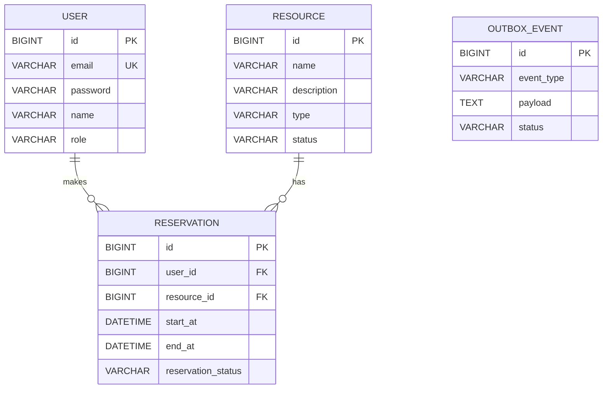

# ResourceHub

> 공유 자원의 예약과 관리를 위한 Spring Boot 기반 백엔드 시스템

ResourceHub는 회의실, 장비, 서버, 차량 등의 **공유 자원을 등록하고 예약할 수 있는 서비스**입니다.

단순 CRUD 구현을 넘어 실제 서비스에서 발생할 수 있는 **인증/인가, 예약 동시성, 캐시 정합성, 비동기 이벤트 처리, 메시지 중복 처리, DB와 메시지 브로커 간 정합성 문제**를 직접 경험하고 해결하는 것을 목표로 개발했습니다.

---

## 🛠 Tech Stack

### Backend

- Java 21
- Spring Boot
- Spring MVC
- Spring Data JPA
- Hibernate
- Spring Security
- JWT
- Gradle

### Database & Cache

- MySQL
- Redis

### Messaging

- Apache Kafka

### Infrastructure & Deployment

- Docker
- Docker Compose
- AWS EC2
- AWS RDS
- AWS Systems Manager
- Nginx
- GitHub Actions
- GitHub Container Registry
- AWS OIDC

---

# 📌 주요 기능

### User

- 회원가입
- 로그인
- BCrypt 기반 비밀번호 암호화
- JWT 기반 인증/인가
- Access Token / Refresh Token 발급
- Redis 기반 Refresh Token 관리
- 로그아웃

### Resource

- 공유 자원 등록
- 자원 목록 조회
- 자원 상세 조회
- 자원 수정
- 자원 삭제
- Redis 기반 상세 조회 캐싱

### Reservation

- 자원 예약
- 예약 목록 및 상세 조회
- 예약 취소
- 동일 자원에 대한 중복 예약 방지
- Kafka 기반 예약 생성 이벤트 처리

---

# 🏗 System Architecture

```text
                         Client
                           │
                      HTTP / HTTPS
                           │
                           ▼
                    ┌─────────────┐
                    │    Nginx    │
                    │   Docker    │
                    └──────┬──────┘
                           │
                           ▼
                ┌─────────────────────┐
                │    ResourceHub      │
                │    Spring Boot      │
                │      Docker         │
                └───┬────────┬────────┘
                    │        │
           ┌────────┘        └─────────┐
           ▼                           ▼
    ┌─────────────┐             ┌─────────────┐
    │    Redis    │             │    Kafka    │
    │   Docker    │             │   Docker    │
    └─────────────┘             └─────────────┘
           │
           │                    reservation-events
           │                           │
           │                    ┌──────┴──────┐
           │                    ▼             ▼
           │              notification   statistics
           │                 group          group
           │
           ▼
    Refresh Token
    Resource Cache
    Consumer Idempotency

                ResourceHub
                     │
                     ▼
               ┌───────────┐
               │  AWS RDS  │
               │   MySQL   │
               └───────────┘
```

운영 환경에서는 Spring Boot, Redis, Kafka, Nginx를 Docker Compose로 관리하며, MySQL은 애플리케이션 서버와 분리하여 AWS RDS를 사용합니다.

---

# 🗄 ERD



`Reservation`은 `User`, `Resource`와 각각 `ManyToOne` 관계를 가지며 연관관계는 기본적으로 LAZY Loading을 사용합니다.

예약 목록 조회 시 Resource 정보가 필요한 경우 Fetch Join을 사용하여 불필요한 추가 Query 발생을 줄였습니다.

`OutboxEvent`는 특정 Entity와 FK 관계를 맺는 테이블이 아니라 Kafka에 발행해야 할 이벤트를 저장하는 독립적인 Outbox 테이블로 사용합니다.

---

# 📡 API

## User API

| Method | Endpoint | Description | Authentication |
|---|---|---|---|
| POST | `/api/users` | 회원가입 | X |
| POST | `/api/users/login` | 로그인 | X |
| POST | `/api/users/refresh` | Access Token 재발급 | X |
| POST | `/api/users/logout` | 로그아웃 | O |

## Resource API

| Method | Endpoint | Description |
|---|---|---|
| GET | `/api/resources` | 자원 목록 조회 |
| GET | `/api/resources/{id}` | 자원 상세 조회 |
| POST | `/api/resources` | 자원 등록 |
| PUT | `/api/resources/{id}` | 자원 수정 |
| DELETE | `/api/resources/{id}` | 자원 삭제 |

## Reservation API

| Method | Endpoint | Description |
|---|---|---|
| GET | `/api/reservations` | 예약 목록 조회 |
| GET | `/api/reservations/{id}` | 예약 상세 조회 |
| POST | `/api/reservations` | 예약 생성 |
| PATCH | `/api/reservations/{id}/cancel` | 예약 취소 |

---

# 🔑 핵심 기술 구현

## 1. Spring Security + JWT 인증/인가

Spring Security와 JWT를 이용하여 인증/인가를 구현했습니다.

로그인 성공 시 Access Token과 Refresh Token을 발급하고, Access Token은 API 인증에 사용하며 Refresh Token은 Redis에서 관리합니다.

```text
Login
  │
  ▼
BCrypt Password Verification
  │
  ▼
Access Token + Refresh Token
  │
  ├── Access Token ──→ Client
  │
  └── Refresh Token ─→ Redis
```

JWT Filter에서는 Access Token의 Subject에 저장된 이메일을 이용하여 사용자를 조회하고 인증 객체를 생성한 뒤 `SecurityContextHolder`에 등록합니다.

JWT 내부 권한 정보만 신뢰하는 대신 DB에서 현재 사용자의 권한을 조회하도록 구현했습니다.

### Refresh Token

Refresh Token은 Redis에 다음 Key 형태로 저장합니다.

```text
refresh:{email}
```

TTL을 적용하여 토큰 유효기간이 지나면 자동으로 제거되도록 구성했습니다.

토큰 재발급 시 저장된 Refresh Token을 검증하고 새로운 Refresh Token으로 교체하며, 로그아웃 시 Redis에서 Refresh Token을 삭제합니다.

### Trade-off

Access Token은 서버에 별도로 저장하지 않으므로 로그아웃하더라도 이미 발급된 Access Token은 만료 시점까지 유효할 수 있습니다.

---

## 2. 비관적 락을 이용한 예약 동시성 제어

예약 생성 전 기존 예약을 조회하는 것만으로는 동시 요청에서 중복 예약을 완전히 방지할 수 없습니다.

```text
Request A ── 중복 예약 없음 확인
Request B ── 중복 예약 없음 확인

Request A ── 예약 저장
Request B ── 예약 저장

→ 동일 시간대 중복 예약
```

`@Transactional`을 적용하더라도 두 Transaction이 동시에 기존 데이터를 조회할 수 있기 때문에 이 문제 자체가 해결되지는 않습니다.

따라서 예약 생성 시 대상 `Resource` Row에 **PESSIMISTIC_WRITE Lock**을 획득하도록 구현했습니다.

```text
Request A
    │
    ▼
Resource Lock
    │
    ├── 중복 예약 확인
    ├── Reservation INSERT
    └── COMMIT
          │
          ▼
       Lock 해제
          │
          ▼
     Request B 진행
```

예약 중복 여부는 다음 조건으로 판단합니다.

```text
existing.startAt < requestedEnd
AND
existing.endAt > requestedStart
```

이를 통해 동일 Resource에 대한 예약 생성 요청을 직렬화하여 중복 예약을 방지합니다.

### Trade-off

Resource 단위로 Lock을 획득하기 때문에 실제 예약 시간이 서로 겹치지 않더라도 동일 Resource에 대한 예약 생성 요청은 순차적으로 처리됩니다.

현재 프로젝트에서는 처리량보다 예약 데이터의 정합성을 우선하여 비관적 락 방식을 선택했습니다.

---

## 3. Redis Cache-Aside

Resource 상세 조회 시 반복적인 DB 접근을 줄이기 위해 Redis Cache를 적용했습니다.

Cache Key는 다음과 같습니다.

```text
resource:{resourceId}
```

조회 시 Redis를 먼저 확인하고 데이터가 존재하지 않을 경우 DB에서 조회한 뒤 Redis에 저장하는 **Cache-Aside Pattern**을 사용했습니다.

```text
Resource 조회
     │
     ▼
   Redis
   /   \
 HIT    MISS
 │       │
 ▼       ▼
Return   MySQL
          │
          ▼
      Redis 저장
          │
          ▼
        Return
```

Cache에는 TTL을 설정하여 일정 시간이 지나면 자동으로 제거되도록 구성했습니다.

---

## 4. Transaction Commit 이후 Cache Eviction

Resource가 수정되거나 삭제되면 기존 Cache를 제거해야 합니다.

하지만 DB Transaction Commit 이전에 Cache를 삭제하면 다음과 같은 Race Condition이 발생할 수 있습니다.

```text
Transaction A
Resource 수정
    │
    ├── Cache 삭제
    │
    │
    │       Request B
    │           │
    │           ├── Cache MISS
    │           ├── 이전 DB 값 조회
    │           └── 이전 값을 Redis에 저장
    │
    ▼
DB Commit

→ Redis에 이전 데이터가 다시 저장될 가능성
```

이를 방지하기 위해 Resource 변경 시 Spring Event를 발행하고,

```java
@TransactionalEventListener(
    phase = TransactionPhase.AFTER_COMMIT
)
```

을 이용하여 **DB Transaction Commit 이후 Cache를 삭제**하도록 구성했습니다.

```text
Resource Update
      │
      ▼
DB Transaction
      │
      ├── UPDATE
      └── ResourceChangedEvent
               │
               ▼
             COMMIT
               │
               ▼
          AFTER_COMMIT
               │
               ▼
       Redis Cache Delete
```

### Trade-off

MySQL Transaction과 Redis 작업을 하나의 원자적 Transaction으로 처리하는 것은 아닙니다.

따라서 DB Commit은 성공했지만 Redis Cache 삭제가 실패하면 일시적으로 이전 데이터가 남을 수 있습니다.

현재는 Cache TTL을 통해 오래된 데이터가 최종적으로 제거될 수 있도록 구성했습니다.

---

## 5. Kafka 기반 이벤트 처리

예약 생성 이후 알림과 통계 같은 후속 작업을 예약 생성 로직과 분리하기 위해 Kafka를 적용했습니다.

예약 이벤트는 다음 Topic으로 전달됩니다.

```text
reservation-events
```

서로 다른 목적의 Consumer가 동일 Event를 독립적으로 처리할 수 있도록 Consumer Group을 분리했습니다.

```text
              reservation-events
                      │
              ┌───────┴───────┐
              ▼               ▼
     notification-group   statistics-group
              │               │
              ▼               ▼
            알림              통계
```

동일 Consumer Group 내부에서는 Partition을 나누어 처리하고, 서로 다른 Consumer Group은 동일 Event를 각각 소비할 수 있습니다.

이를 통해 예약 생성 로직과 후속 처리 로직의 결합도를 낮췄습니다.

---

## 6. Consumer 멱등성

Kafka의 At-Least-Once 처리 환경에서는 동일 메시지가 Consumer에 다시 전달될 수 있습니다.

예를 들어 Consumer가 메시지 처리를 완료한 뒤 Offset Commit 전에 장애가 발생하면 동일 메시지가 다시 처리될 수 있습니다.

```text
Kafka Message
     │
     ▼
Consumer 처리 성공
     │
     X  Offset Commit 전 장애
     │
     ▼
Consumer 재시작
     │
     ▼
동일 Message 재전달
```

중복 처리를 방지하기 위해 Redis의 원자적 연산인 `SET NX`를 사용했습니다.

```text
processed:notification:{reservationId}
```

Spring Data Redis에서는 `setIfAbsent()`를 이용합니다.

```java
Boolean firstProcess =
        stringRedisTemplate.opsForValue()
                .setIfAbsent(key, reservationId);
```

`GET → SET`을 별도로 수행하면 여러 Consumer가 동시에 Key가 없다고 판단할 수 있기 때문에 하나의 원자적 연산으로 최초 처리 여부를 판단하도록 구현했습니다.

### Trade-off

Redis에 멱등성 Key를 기록하는 작업과 실제 비즈니스 처리는 하나의 Transaction이 아닙니다.

따라서 Key 기록에는 성공했지만 실제 후속 작업이 실패하면 재전달된 Event를 이미 처리된 Event로 판단할 가능성이 있습니다.

또한 멱등성 Key에 TTL을 적용한다면 TTL 이후 도착한 오래된 중복 Event는 다시 최초 처리로 판단될 수 있으므로 실제 서비스에서는 요구되는 멱등성 보장 범위를 함께 설계해야 합니다.

---

## 7. Kafka Retry & Dead Letter Topic

Consumer 처리 과정에서 일시적인 장애가 발생할 수 있기 때문에 `DefaultErrorHandler`를 이용하여 Retry 정책을 구성했습니다.

```text
Initial Attempt
      │
      X
  1초 대기
      │
   Retry 1
      │
      X
  1초 대기
      │
   Retry 2
      │
      X
      ▼
Dead Letter Topic
```

초기 처리 1회와 Retry 2회를 포함하여 총 3번의 처리를 시도합니다.

계속 실패하는 메시지는 Dead Letter Topic으로 전달하여 정상 메시지의 처리가 계속될 수 있도록 구성했습니다.

DLT에 전달된 메시지는 실패 원인 분석 및 별도 재처리 대상으로 활용할 수 있습니다.

---

## 8. Transactional Outbox

Reservation을 DB에 저장한 뒤 Kafka Event를 직접 발행하면 DB와 Kafka가 서로 독립된 시스템이기 때문에 **Dual Write 문제**가 발생할 수 있습니다.

### DB Commit 성공 / Kafka 발행 실패

```text
Reservation DB Commit
        │
        X
Kafka Publish 실패

→ 예약은 존재하지만 Event가 전달되지 않음
```

반대로 Kafka 발행 이후 DB Transaction이 Rollback되는 상황도 고려할 수 있습니다.

```text
Kafka Publish
      │
      X
DB Rollback

→ 존재하지 않는 예약에 대한 Event 발생 가능
```

이를 개선하기 위해 **Transactional Outbox Pattern**을 적용했습니다.

Reservation과 Kafka에 발행해야 할 Event를 동일한 DB Transaction 안에서 저장합니다.

```text
Reservation Transaction
          │
          ├── Reservation INSERT
          │
          └── OutboxEvent INSERT
                    │
               status=PENDING
                    │
                    ▼
                  COMMIT
```

별도의 `OutboxPublisher`가 주기적으로 `PENDING` 상태의 Event를 조회하여 Kafka에 발행합니다.

```text
OutboxEvent
  PENDING
     │
     ▼
OutboxPublisher
     │
     ▼
Kafka Publish
     │
     ▼
 PUBLISHED
```

Kafka 발행에 실패하면 Outbox Event가 `PENDING` 상태로 유지되므로 이후 다시 발행을 시도할 수 있습니다.

### 중복 발행 가능성

Transactional Outbox를 사용하더라도 중복 발행 가능성은 존재합니다.

```text
Kafka Publish 성공
        │
        X
PUBLISHED 상태 Commit 전 장애
        │
        ▼
Outbox = PENDING
        │
        ▼
다음 Polling에서 재발행
```

따라서 Exactly-Once를 가정하는 대신 **중복 전달 가능성을 인정하고 Consumer 측에서 멱등성을 보장하는 방향**으로 구성했습니다.

### Transaction 범위의 Trade-off

현재 Outbox Publisher는 여러 `PENDING` Event를 하나의 Transaction에서 처리합니다.

```text
Event A → Kafka 성공
Event B → Kafka 성공
Event C → Kafka 실패
              │
              ▼
       Transaction Rollback
              │
              ▼
A, B, C 모두 PENDING
```

A와 B는 이미 Kafka에 전달되었지만 DB의 상태 변경은 Rollback되므로 다음 Polling에서 다시 발행될 수 있습니다.

Event 단위로 Transaction을 분리하면 중복 발행 범위를 줄일 수 있지만 Transaction 횟수가 증가합니다.

현재 프로젝트에서는 구현 복잡도와 프로젝트 규모를 고려하여 현재 구조를 유지하고 Consumer 멱등성을 통해 중복 처리에 대응했습니다.

---

# 🔐 Validation & Exception Handling

Request DTO에 Bean Validation을 적용하여 입력값을 검증합니다.

주요 Validation Annotation은 다음과 같습니다.

```text
@NotBlank
@NotNull
@Email
@Size
```

Controller에서는 `@Valid`를 이용하여 Validation을 수행합니다.

입력값 자체에 대한 검증과 DB 조회가 필요한 비즈니스 검증을 분리했습니다.

```text
이메일 형식 오류
→ Bean Validation

예약 시작/종료 시간 규칙
→ Service

기존 예약과 시간 중복
→ Service + Repository
```

`GlobalExceptionHandler`를 통해 비즈니스 예외를 HTTP Status로 변환합니다.

| 상황 | HTTP Status |
|---|---|
| 잘못된 요청 | `400 Bad Request` |
| 인증 실패 | `401 Unauthorized` |
| 존재하지 않는 Resource | `404 Not Found` |
| 존재하지 않는 Reservation | `404 Not Found` |
| 존재하지 않는 User | `404 Not Found` |
| 예약 충돌 | `409 Conflict` |
| 사용자 중복 | `409 Conflict` |
| 삭제할 수 없는 Resource | `409 Conflict` |

기본 Error Response는 다음 형태로 반환합니다.

```json
{
  "message": "Error message"
}
```

---

# 🐳 Docker

로컬 개발 환경에서는 Docker Compose를 이용하여 필요한 인프라를 구성할 수 있습니다.

```text
Docker Compose
     │
     ├── ResourceHub
     │     └── :8080
     │
     ├── MySQL 8
     │     └── :3306
     │
     ├── Redis 7
     │     └── :6379
     │
     └── Kafka
           └── :9092
```

MySQL에는 Docker Volume을 적용하여 Container가 제거되더라도 데이터를 유지하도록 구성했습니다.

또한 MySQL Health Check를 적용하여 DB가 정상적으로 실행된 이후 애플리케이션이 시작될 수 있도록 구성했습니다.

### Docker Image

Spring Boot 애플리케이션은 Multi-stage Docker Build를 사용합니다.

```text
Gradle + JDK 21
      │
      │ bootJar
      ▼
Spring Boot JAR
      │
      ▼
JRE 21 Runtime Image
      │
      ▼
ResourceHub Container
```

빌드 환경과 실행 환경을 분리하여 최종 Container에서는 애플리케이션 실행에 필요한 Runtime 환경만 사용하도록 구성했습니다.

---

# 🚀 Deployment Architecture

운영 환경은 AWS EC2를 기반으로 구성했습니다.

```text
                       Internet
                          │
                     HTTP / HTTPS
                          │
                          ▼
                  ┌──────────────┐
                  │    Nginx     │
                  │ EC2 / Docker │
                  └───────┬──────┘
                          │
                          ▼
                ┌──────────────────┐
                │   ResourceHub    │
                │  Spring Boot     │
                │   EC2 / Docker   │
                └────┬────────┬────┘
                     │        │
              ┌──────┘        └──────┐
              ▼                      ▼
       ┌────────────┐          ┌────────────┐
       │   Redis    │          │   Kafka    │
       │   Docker   │          │   Docker   │
       └────────────┘          └────────────┘

                ResourceHub
                     │
                     ▼
               ┌───────────┐
               │  AWS RDS  │
               │   MySQL   │
               └───────────┘
```

운영 환경의 역할은 다음과 같이 분리했습니다.

| Component | Environment |
|---|---|
| Spring Boot | AWS EC2 / Docker |
| Nginx | AWS EC2 / Docker |
| Redis | AWS EC2 / Docker |
| Kafka | AWS EC2 / Docker |
| MySQL | AWS RDS |
| Container Registry | GHCR |

애플리케이션, Redis, Kafka, Nginx는 Docker Compose를 이용하여 관리하며 MySQL은 애플리케이션 서버와 분리하여 AWS RDS를 사용합니다.

---

# 🔄 CI/CD

GitHub Actions를 이용하여 `main` 브랜치 Push 이후 테스트, Docker Image 생성 및 운영 서버 배포 과정을 자동화했습니다.

```text
Push to main
      │
      ▼
GitHub Actions
      │
      ├── Checkout
      │
      ├── Java 21 Setup
      │
      └── Gradle Test
              │
              ▼
       Docker Image Build
              │
              ▼
             GHCR
              │
              ▼
     AWS OIDC Authentication
              │
              ▼
       AWS Systems Manager
             (SSM)
              │
              ▼
             EC2
              │
              ├── git pull
              ├── Docker Image Pull
              ├── Application Update
              └── Nginx Restart
```

### GitHub Container Registry

GitHub Actions에서 애플리케이션 Docker Image를 Build한 뒤 GHCR에 Push합니다.

```text
ghcr.io/{owner}/resourcehub:latest
```

운영 EC2에서는 해당 Image를 Pull하여 Application Container를 갱신합니다.

### AWS OIDC

GitHub Actions에 장기 AWS Access Key를 저장하는 대신 **OIDC를 이용하여 AWS IAM Role을 Assume**하도록 구성했습니다.

```text
GitHub Actions
      │
      │ OIDC
      ▼
AWS IAM Role
      │
      ▼
AWS Resources
```

이를 통해 CI/CD 과정에서 장기 AWS Credential을 직접 관리하지 않도록 구성했습니다.

### AWS Systems Manager

배포 명령은 SSH 직접 접속 대신 AWS Systems Manager를 통해 EC2에 전달합니다.

SSM Command를 통해 EC2에서 최신 Source를 Pull하고 GHCR의 최신 Application Image를 받아 Container를 갱신합니다.

---

# ⚙️ 기술적 의사결정

| 문제 | 적용 방식 | 선택 이유 |
|---|---|---|
| API 인증/인가 | Spring Security + JWT | Stateless 인증 구조 |
| 비밀번호 저장 | BCrypt | Salt가 적용된 단방향 Hash |
| Refresh Token 관리 | Redis | 빠른 조회/삭제 및 TTL |
| 예약 동시성 | Pessimistic Lock | 동일 Resource 중복 예약 방지 |
| 반복 Resource 조회 | Redis Cache-Aside | DB 조회 감소 |
| 캐시 정합성 | AFTER_COMMIT Eviction | Commit 이전 Cache 재생성 방지 |
| 예약 후속 처리 | Kafka | 예약 생성과 후속 작업 분리 |
| Consumer 중복 처리 | Redis SET NX | At-Least-Once 중복 처리 대응 |
| Consumer 장애 | Retry + DLT | 제한적 재시도 및 실패 메시지 격리 |
| DB-Kafka Dual Write | Transactional Outbox | Event 유실 가능성 감소 및 재발행 |
| Local Infrastructure | Docker Compose | 개발 환경 구성 단순화 |
| 운영 DB | AWS RDS | Application Server와 DB 분리 |
| Container Registry | GHCR | CI/CD와 Container Image 연계 |
| AWS 인증 | GitHub OIDC | 장기 AWS Access Key 관리 최소화 |
| EC2 배포 | AWS SSM | SSH 직접 접속 없는 배포 자동화 |

---

# ⚠️ 한계 및 개선 방향

## 1. Consumer 멱등성

Redis 멱등성 Key 저장과 실제 비즈니스 작업은 하나의 Transaction이 아닙니다.

Key 저장 이후 실제 작업이 실패하는 경우 재전달된 메시지가 이미 처리된 것으로 판단될 가능성이 있으므로 실제 서비스에서는 처리 결과까지 고려한 멱등성 전략이 필요합니다.

## 2. Outbox Polling

현재 Outbox Publisher는 일정 주기로 DB의 `PENDING` Event를 Polling합니다.

서비스 규모가 커질 경우 Polling 주기와 DB 부하를 고려한 개선이 필요합니다.

## 3. Outbox Transaction 범위

여러 Event를 하나의 Transaction에서 처리하기 때문에 일부 Event에서 실패하면 이미 Kafka에 전달된 Event까지 다시 발행될 수 있습니다.

Event 단위 Transaction을 적용하면 중복 발행 범위를 줄일 수 있지만 Transaction 횟수가 증가하는 Trade-off가 있습니다.

## 4. Cache Consistency

MySQL과 Redis는 하나의 Transaction으로 묶이지 않습니다.

DB Commit 이후 Cache 삭제에 실패할 경우 일정 시간 동안 이전 Cache가 남아 있을 수 있으며 현재는 TTL을 통해 최종적으로 오래된 Cache가 제거되도록 구성했습니다.

## 5. Access Token Logout

Access Token은 Stateless하게 검증하기 때문에 로그아웃 이후에도 이미 발급된 Access Token은 만료 시점까지 유효할 수 있습니다.

보안 요구사항에 따라 Access Token Blacklist 등의 방식을 추가로 고려할 수 있습니다.

## 6. Automated Testing

현재 자동화된 테스트가 충분하지 않습니다.

특히 다음과 같은 테스트를 추가할 수 있습니다.

- 동일 Resource에 대한 동시 예약 생성 테스트
- 비관적 락 적용 전후 동시성 검증
- Cache Hit / Miss 테스트
- Transaction Rollback 시 Cache Eviction 검증
- Kafka Consumer 중복 메시지 처리 테스트
- Outbox 재발행 테스트

---

# 📚 프로젝트를 통해 학습한 내용

ResourceHub를 개발하면서 단순히 기술을 사용하는 것보다 **어떤 문제를 해결하기 위해 해당 기술이 필요한지 이해하는 것**에 중점을 두었습니다.

주요 학습 내용은 다음과 같습니다.

- Spring MVC Request 처리 흐름
- Spring Security Filter Chain
- JWT 인증/인가
- BCrypt Password Hashing
- JPA Persistence Context
- Dirty Checking
- LAZY Loading과 Fetch Join
- Database Transaction
- 비관적 락을 이용한 동시성 제어
- Redis Cache-Aside Pattern
- Cache Consistency
- Spring Transaction Event
- Kafka Topic / Partition / Offset
- Kafka Consumer Group
- At-Least-Once Delivery
- Consumer Idempotency
- Retry / Dead Letter Topic
- DB-Kafka Dual Write 문제
- Transactional Outbox Pattern
- Docker와 Docker Compose
- AWS EC2 / RDS
- GitHub Actions CI/CD
- GHCR
- AWS OIDC
- AWS Systems Manager

특히 구현 과정에서 **완벽한 해결책을 적용하는 것보다 각 기술이 해결하는 문제와 새롭게 발생시키는 Trade-off를 함께 이해하는 것**을 목표로 했습니다.